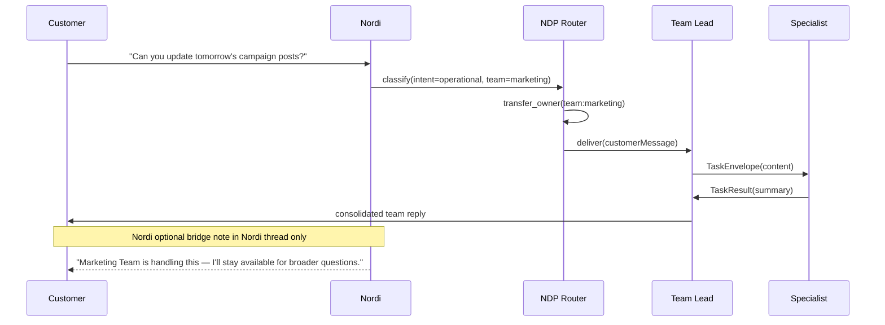
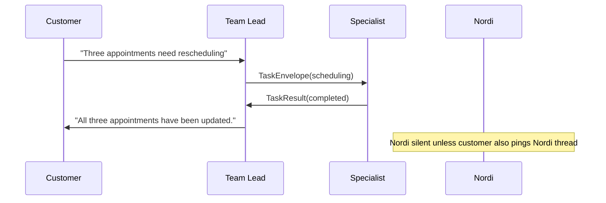
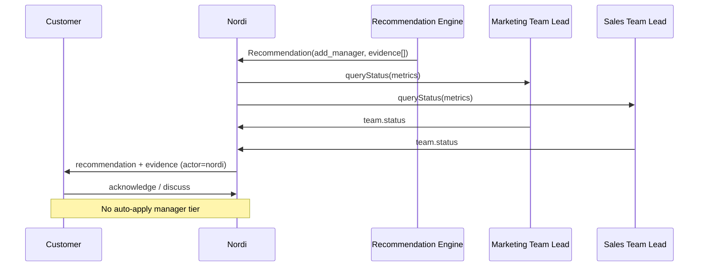
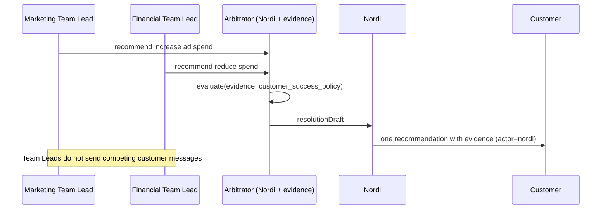

# Northbridge Digital Workforce Communication Protocol v1.0

**Status:** Approved planning document (behavioral specification)  
**Owner:** NEO (reusable protocol) + Northbridge Digital (product enforcement)  
**Applies to:** All industries, all team products, all organizational layers (future layers feature-gated at launch)

**Source of truth (read with this document):**

- [Workforce Inventory v1.0](./northbridge-digital-workforce-inventory-v1.md)
- [Organizational Structure v1.0](./northbridge-digital-workforce-organizational-structure-v1.md)
- [Execution Plan v1.0](./northbridge-digital-workforce-execution-plan-v1.md)
- [Nordi Mobile Architecture](./nordi-mobile-architecture.md)

**Doctrine:** *We succeed when you succeed.*

---

## 1. Purpose

This document defines **how every member of the Northbridge Digital workforce communicates** — internally and externally — independent of industry.

It is the behavioral specification for routing, ownership, escalation, collaboration, conflict resolution, and reporting. Engineering implementations must conform to this protocol; they must not invent alternate communication paths in product code.

**Planning only.** No code is authorized by this document.

---

## 2. Guiding principles

| Principle | Communication implication |
|-----------|---------------------------|
| Customers hire business capability, not AI agents | Customer-facing voice is always a **team** or **Nordi** — never a raw specialist id |
| Teams are products | External threads default to **team ownership** |
| Specialists are reusable | Specialists communicate **internally** within permission envelopes; never industry-branded |
| Nordi represents Northbridge Digital | Nordi messages carry `actor: nordi`; Nordi is outside customer org chart |
| Coordinated and intentional | Every customer-visible message has a **single owner** and traceable lineage |
| No conflicting recommendations | Conflicts are resolved **before** customer delivery via defined arbitration |

### Communication qualities

All workforce communication must be:

- **Clear** — one owner, one purpose per outbound message
- **Concise** — specialists report facts; Team Leads synthesize; Nordi advises
- **Accountable** — audit log: who sent, on whose authority, with what evidence
- **Non-duplicative** — deduplication keys on `(orgId, topic, owner, window)`
- **Evidence-based** — recommendations cite operational data
- **Customer-success-first** — revenue optimization never wins arbitration

---

## 3. Communication layers

### Layer 0 — Customer

The customer interacts only with **authorized external actors**:

| Actor | Visibility at launch | Customer sees | Customer does not see |
|-------|---------------------|---------------|------------------------|
| **Nordi** | Always (when entitled) | Northbridge Digital advisor | Internal routing, specialist names (default) |
| **Team** (via Team Lead) | Per hired team product | Team name + unified team voice | Individual specialist identities (default) |
| **Manager** | Future (feature-gated) | Department summary voice | Specialist-level detail |
| **Director** | Future | Strategic rollup | Operational detail |
| **Vice President** | Future | Executive insight | Day-to-day operations |

#### Customer ownership rules

1. **Exactly one owner** per customer request at any time (`RequestOwner`).
2. Customer may **initiate** in Nordi thread or team thread — ownership transfers only via router, never implicitly.
3. Customer never receives **parallel contradictory recommendations** from two owners; conflicts use Section 9.
4. Customer may **acknowledge** recommendations; they do not **configure** org structure via comms UI.

#### Customer channel map (launch)

| Channel | Default owner | Notes |
|---------|---------------|-------|
| Nordi conversation | Nordi | Relationship, analysis, org recommendations |
| Team conversation | Team Lead of that team | Operational work for hired team |
| Dashboard / reports | NDP (data) + Nordi (optional insight) | Read-only; not a chat owner |
| Billing notices | NDP billing service | Factual; Nordi may explain, not own invoice generation |

---

### Layer 1 — Nordi

Nordi is **Level 0** in the organizational structure — outside the customer's hierarchy.

#### Responsibilities

- Customer relationship and trust
- Cross-team synthesis and business analysis
- Service recommendations (add/remove team, wait, simplify)
- Upgrade / downgrade / no-change guidance with evidence
- Explaining team reports in plain language
- Escalation to Northbridge human support when policy requires
- Conversation learning consent (with customer)

#### Limitations

- Nordi **does not** execute team operational tasks (scheduling, campaigns, CRM updates)
- Nordi **does not** impersonate Team Lead, Manager, or customer executive
- Nordi **does not** send specialist-level technical detail unless customer explicitly opts into "detailed mode" (future)
- Nordi **does not** override Team Lead operational decisions inside team scope
- Nordi **does not** optimize for subscription revenue in recommendations

#### When Nordi responds directly

| Situation | Nordi responds |
|-----------|----------------|
| Customer addresses Nordi thread | Yes — owner stays Nordi |
| Customer asks relationship / strategic / org question | Yes |
| Customer asks "what should I hire or change?" | Yes — with evidence |
| Customer asks operational question **scoped to one team** | Nordi **routes** to Team Lead; may add brief framing only |
| Team report published | Nordi **may** summarize optionally — does not replace team attribution |

#### When Nordi routes work

- Operational task clearly belongs to one hired team → `transfer_owner(teamLead)`
- Customer message mentions team by name → route to that team if entitled
- Ambiguous operational ask → Nordi asks **one** clarifying question, then routes
- Request requires team not hired → Nordi explains gap; may recommend add_team (evidence)

#### When Nordi summarizes work

- After team completes customer-visible work → Nordi may post **optional** recap in Nordi thread with citation `source: team:{teamId}`
- Periodic business reviews (evidence-based cadence, not daily spam)
- Before organizational recommendation → synthesize cross-team metrics

#### When Nordi recommends organizational changes

- Only via Recommendation Engine with `evidence[]` (see Execution Plan Phase 8)
- Delivered in Nordi thread with clear **recommendation** message type — not buried in casual chat
- Customer may acknowledge; no auto-apply for manager+ tiers

#### When Nordi stays silent

- Team thread is active owner and conversation is mid-task — Nordi does not interject
- Insufficient evidence for recommendation — use explicit `wait`, not filler
- Duplicate topic already owned by team within dedup window
- Customer venting without actionable ask — brief empathy allowed, no unsolicited org advice

#### Nordi escalation rules

| Condition | Escalation target |
|-----------|-------------------|
| Policy / billing dispute | NDP billing + optional human support queue |
| Safety / legal sensitivity | Human review gate — no automated reply |
| Customer requests human | Northbridge support handoff (not "Schedule a Call" in mobile customer app) |
| Team Lead reports blocker outside permissions | Nordi logs + customer transparency in Nordi thread |

---

### Layer 2 — Teams

Each **team product** (Inventory v1.0) is a communication unit with a **Team Lead** as the single external voice.

#### Team responsibilities

- Deliver business outcomes for their domain (marketing, sales, CS, industry bundle, etc.)
- Own team-customer threads for operational work
- Aggregate specialist outputs into coherent customer responses
- Produce team operational reports (dashboard/mobile)
- Escalate to Nordi when cross-team or org-level guidance needed

#### Team ownership

- `RequestOwner = team:{teamProductId}` for operational requests routed to that team
- Team Lead is the **only** default customer-facing identity for the team
- Team memory is shared among specialists on that team instance

#### Customer visibility

- Customer sees: **Team name** (e.g. "Marketing Team", "Dental Office Team")
- Customer does not see: specialist roster, internal task splits, model identifiers
- Exception (future product setting): "show specialist attribution" — default **off** at launch

#### Team Lead ↔ Customer

- Team Lead sends **one** consolidated reply per customer turn (may internalize multi-specialist work)
- Tone: operational, professional, aligned with team mission
- Team Lead cites actions taken, not internal reasoning chains

#### Team Lead ↔ Nordi

- Team Lead may **request** Nordi synthesis (internal API): "cross-team context needed"
- Team Lead sends **structured status** to Nordi: `team.status`, blockers, metrics — not raw chat logs
- Nordi may **query** Team Lead for evidence before org recommendations
- Team Lead does not instruct Nordi on subscription pricing

#### Team Lead ↔ Team Lead (cross-team)

- Default: **no direct customer-visible co-messaging**
- Collaboration via **Collaboration Session** (Section 8) with shared owner rules
- Async handoff through NDP router — never two teams replying independently to same customer message

---

### Layer 3 — Specialists

Specialists are **internal workforce capabilities** unless product policy explicitly exposes them.

#### How specialists receive work

```
Team Lead → TaskEnvelope { specialistId, permissions, context, deadline, customerThreadRef? }
  → Specialist runtime validates canDo
  → Accept | Reject (with reason) → Team Lead reroutes
```

- Tasks are **never** assigned customer-to-specialist directly at launch
- Task queue is team-scoped

#### How specialists report completion

```
Specialist → TaskResult { summary, evidence, artifacts[], escalation? }
  → Team Lead inbox (internal)
  → Team Lead decides customer visibility
```

Reports are **structured**, not free-form chat to customer.

#### Customer communication

| Specialist type | Customer-facing default |
|-----------------|-------------------------|
| All Inventory v1.0 specialists | **No** — Team Lead synthesizes |
| Future exception (explicit product flag) | Named specialist with Team Lead approval |

#### Specialist ↔ Specialist (same team)

- Allowed: **internal** coordination on shared task via team workspace
- Protocol: threaded internal notes attached to `taskId`
- Not allowed: parallel customer replies

#### Specialist ↔ Specialist (across teams)

- **Not allowed** directly
- Must go through Team Lead collaboration session or Nordi-orchestrated handoff

#### Escalation (specialist)

| Situation | Escalate to |
|-----------|-------------|
| Task outside `canDo` | Team Lead |
| Missing context | Team Lead |
| Cross-team dependency | Team Lead → Collaboration Session |
| Policy/safety | Team Lead → Nordi → human gate |

---

### Future layers — Managers, Directors, Vice Presidents

**Not in public launch.** Protocol defined for forward compatibility.

| Layer | External customer voice | Internal role | Reports to customer |
|-------|----------------------|---------------|---------------------|
| **Manager** | Optional department summary (single voice) | Coordinates 2+ Team Leads | Department rollup; hides specialist noise |
| **Director** | Strategic updates only (rare) | Coordinates managers | Cross-department alignment summary |
| **VP** | Executive insight (scheduled) | Coordinates directors | Long-horizon business themes |

Rules:

- Managers **do not** replace Team Lead for operational team threads at launch transition
- When enabled, Manager becomes owner of **cross-team conflicts** (Section 9) before Nordi customer delivery
- Directors/ VPs never bypass Manager operational chain without explicit escalation type `executive_review`

Feature flags: `managers_enabled`, `directors_enabled`, `vps_enabled` — all default **false**.

---

## 4. Routing rules

### Core invariant

> **Every request has exactly one `RequestOwner` at all times.**

`RequestOwner` ∈ `{ nordi, team:{id}, manager:{id}, director:{id}, vp:{id} }`

### Routing decision tree

```
Incoming customer message
  ├─ Channel = nordi thread?
  │    ├─ Intent = operational + team identifiable + team hired?
  │    │    → transfer_owner(team) + Nordi optional bridge note
  │    ├─ Intent = org / recommendation / relationship?
  │    │    → owner = nordi
  │    └─ Intent = ambiguous?
  │         → nordi clarifies once → route or keep
  ├─ Channel = team thread?
  │    → owner = that team (must match entitlement)
  └─ Channel = unknown?
       → nordi triage
```

### Delegation chain (operational)

```
Customer → Team Lead (owner) → Specialist(s) (internal) → Team Lead (review) → Customer
```

Nordi is **not** in the delegation chain for team operational tasks unless explicitly consulted.

### Review gate

Before any customer-visible send:

1. **Owner** validates message matches scope
2. **Dedup check** — no duplicate topic reply in window
3. **Conflict check** — no open arbitration on same topic (Section 9)
4. **Audit record** — `{ owner, actor, messageId, evidenceRefs[] }`

---

## 5. Sequence diagrams

### 5.1 Customer asks Nordi an operational question (team hired)



### 5.2 Customer asks Team directly



### 5.3 Nordi organizational recommendation



### 5.4 Cross-team collaboration

```mermaid
sequenceDiagram
    participant C as Customer
    participant TL_M as Marketing Team Lead
    participant TL_S as Sales Team Lead
    participant CS as Collaboration Session
    participant N as Nordi

    C->>TL_S: "Will the new promo affect lead follow-up timing?"
    TL_S->>CS: open(session, participants=[marketing,sales], owner= sales)
    CS->>TL_M: requestInput
    TL_M->>CS: marketingInput
    CS->>TL_S: mergedBrief
    TL_S->>C: single consolidated reply
    Note over N: Nordi notified for metrics only; not co-owner
```

### 5.5 Conflict arbitration (Marketing vs Finance)



---

## 6. Ownership matrix

| Request type | Primary owner | May delegate to | Customer-facing sender | Nordi role |
|--------------|---------------|-----------------|------------------------|------------|
| Relationship / trust | Nordi | — | Nordi | Owner |
| Org recommendation | Nordi | Recommendation Engine | Nordi | Owner |
| Upgrade / downgrade / wait | Nordi | Recommendation Engine | Nordi | Owner |
| Team operational work | Team Lead | Specialists (internal) | Team Lead | Route or silent |
| Team report explanation | Team Lead | — | Team Lead or Nordi summary (cited) | Optional summarize |
| Cross-team operational | Collaboration owner (Team Lead) | Other Team Leads (input) | Collaboration owner | Observe / arbitrate if conflict |
| Billing factual | NDP Billing | — | System notification | Explain only |
| Policy / safety | Human gate | — | Human / approved template | Escalate |
| Manager rollup (future) | Manager | Team Leads (input) | Manager | Advise only |
| Director strategy (future) | Director | Managers | Director | Advise only |

---

## 7. Escalation matrix

| From | Condition | To | Customer visibility |
|------|-----------|-----|---------------------|
| Specialist | Permission denied | Team Lead | None (internal) |
| Specialist | Task blocked | Team Lead | None until Team Lead decides |
| Team Lead | Cross-team dependency | Collaboration Session | Single owner reply when ready |
| Team Lead | Cross-team conflict | Nordi Arbitrator | One Nordi message after resolution |
| Team Lead | Customer org question | Nordi | Transfer or Nordi joins with attribution |
| Team Lead | Safety / legal | Nordi → Human | Hold automated reply |
| Nordi | Insufficient evidence | `wait` state | Transparent "need more data" |
| Nordi | Human requested | Northbridge Support | Handoff message |
| Manager (future) | Director-level strategy | Director | Scheduled executive summary |
| Any | Duplicate owner detected | NDP Router | Suppress duplicate; log incident |

**SLA guidance (product, not hard engineering in v1):**

- Team Lead acknowledges routed work internally within one processing cycle
- Customer never left without owner > defined platform timeout → Nordi sends holding message with owner name

---

## 8. Cross-team collaboration model

### When teams collaborate

- Customer question spans **two or more team domains**
- Work product requires inputs from multiple teams (e.g. promo + pipeline capacity)
- Recommendation Engine detects cross-team friction metric

### How collaboration is initiated

```
Team Lead A → openCollaborationSession {
  topic,
  participantTeamIds[],
  ownerTeamId,        // exactly one
  customerThreadRef,
  ttl
}
```

- Owner Team Lead is **sole customer-facing sender** for that topic until session closes
- Non-owner teams contribute **structured input** only

### Shared work ownership

| Artifact | Owner |
|----------|-------|
| Customer reply | Collaboration session owner (Team Lead) |
| Internal inputs | Contributing teams (attributed in audit) |
| Metrics impact | NDP metrics (tagged with session id) |

### Final response production

1. Owner collects inputs before deadline or `ready` signal from all required participants
2. Owner synthesizes **one** message
3. Conflict sub-topics trigger Section 9 before send

### Duplicate work prevention

- Dedup key: `hash(orgId + normalizedTopic + ownerTeamId)`
- Router rejects second owner assignment for same key within `dedupWindow` (default 24h, configurable)
- Specialists on two teams **cannot** execute same customer task without collaboration session

---

## 9. Conflict resolution model

### Example conflicts

| Team A position | Team B position | Resolution owner |
|-----------------|-----------------|------------------|
| Marketing: increase advertising | Finance: reduce spend | Nordi + evidence arbitrator |
| Sales: hire capacity | Operations: delay expansion | Nordi + evidence arbitrator |
| CS: faster response SLA | Finance: limit overtime tasks | Nordi + evidence arbitrator |

### Process

```
1. Detect conflict (two team recommendations same topic, opposing polarity)
2. Freeze customer-visible sends on that topic
3. Collect evidence from both Team Leads (structured, not chat dumps)
4. Nordi Arbitrator applies customer_success_policy (revenue excluded)
5. Single resolution message (actor=nordi OR owner team if operational-only)
6. Audit log retains both positions + resolution rationale
```

### Who communicates final recommendation

| Conflict type | Customer messenger |
|---------------|-------------------|
| Org / spend / hiring | **Nordi** (always) |
| Operational timing between teams | **Collaboration owner Team Lead** with Nordi-reviewed brief |
| Purely internal optimization | **No customer message** — internal resolution only |

### Evidence evaluation criteria

- Operational metrics (volume, utilization, SLA)
- Historical trends (minimum window per Org Structure: 3–6 months for manager-tier)
- Customer-stated priorities (from Nordi profile)
- **Excluded:** subscription revenue, upsell quotas

---

## 10. Reporting hierarchy

Information **summarizes and strategizes** as it moves up. Raw specialist detail does not reach the customer at executive layers.

```
Specialist TaskResult (granular)
        ↓
Team Lead daily/weekly operational report (team dashboard)
        ↓
Manager department rollup (future — cross-team KPIs, blockers)
        ↓
Director strategic summary (future — initiative alignment)
        ↓
VP executive insight (future — long-horizon themes)
        ↓
Customer-facing: Dashboard + optional Nordi narrative
```

### Report types (launch)

| Report | Producer | Consumer | Cadence |
|--------|----------|----------|---------|
| Task completion | Specialist → Team Lead | Internal | Per task |
| Team operational | Team Lead | Customer dashboard, Nordi | Daily / weekly |
| Recommendation | Recommendation Engine → Nordi | Customer Nordi thread | Event-driven |
| Audit trail | NDP | Compliance, support | Continuous |

### Customer delivery rules

- Dashboard shows **team-level** reports at launch
- Nordi may **annotate** with customer-success context — must cite `teamReportId`
- Managers+ rollups **hidden** until entitled and feature-flag enabled

---

## 11. Future compatibility (Managers, Directors, VPs)

| Capability | Launch | Future enablement |
|------------|--------|-------------------|
| Customer ↔ Team Lead | ✓ | unchanged |
| Customer ↔ Nordi | ✓ | unchanged |
| Customer ↔ Manager | ✗ | Single department voice; operational detail suppressed |
| Team Lead ↔ Manager | Internal schema ready | Manager coordinates Team Lead status pulls |
| Manager ↔ Manager | Via Director chain | Director arbitration for cross-department |
| Nordi ↔ Manager | ✓ internal | Nordi queries manager rollup before org recommendations |
| VP customer messaging | ✗ | Scheduled executive summaries only |

Protocol version field: `communicationProtocolVersion: 1` on all messages for migration.

---

## 12. NEO reusable package recommendations

| Package | Responsibility |
|---------|----------------|
| `@northbridge/workforce-communication-contracts` | `RequestOwner`, `MessageActor`, `TaskEnvelope`, `CollaborationSession`, `ArbitrationRecord` types |
| `@northbridge/communication-router` | Owner assignment, dedup, transfer, invariant enforcement — **platform engine:** `@northbridge/workforce-router` ([ADR-W9](./northbridge-workforce-router-phase-4-design-v1.md#adr-w9-workforce-router-vs-communication-router)); NDP Conversation Router composes with conversation-engine |
| `@northbridge/collaboration-session` | Cross-team session lifecycle |
| `@northbridge/conflict-arbitrator` | Evidence collection interface + resolution struct (policy-agnostic) |
| `@northbridge/reporting-ladder` | Report aggregation levels (specialist → team → manager+) |
| `@northbridge/conversation-engine` (extend) | Actor attribution, channel routing hooks |
| `@northbridge/presentation-policy` (extend) | Customer-visible voice rules |

**NEO owns:** routing invariants, dedup, collaboration mechanics, type contracts.  
**NBD owns:** customer_success_policy weights, Nordi copy, recommendation thresholds.

---

## 13. Northbridge Digital implementation guidance

### NDP services to implement (when authorized)

| Service | Enforces |
|---------|----------|
| **Conversation Router** | Single owner invariant, channel routing |
| **Team Lead Gateway** | External team voice, internal specialist delegation |
| **Collaboration Service** | Cross-team sessions |
| **Arbitration Service** | Conflict freeze + resolution workflow |
| **Audit Service** | Immutable comms audit trail |

### Nordi service modes

| Mode | Protocol profile |
|------|------------------|
| `public-discovery` | Homepage only; not this protocol |
| `customer-success` | Full protocol; mobile + post-hire web |

### Mobile (Nordi Mobile Architecture)

- Thread list shows **Nordi** + **per-team** threads — not specialists
- Push notifications tag `owner` so customer knows who replied
- No UI to message manager+ at launch

### Operations / internal hire flow

- Internal catalog alignment (Inventory v1.0) — separate channel; not customer protocol

### Validation checklist (when implementing)

- [ ] Property test: every message has exactly one owner
- [ ] Scenario: marketing vs finance conflict → single customer outcome
- [ ] Scenario: Nordi routes operational ask → team owns reply
- [ ] Scenario: specialist cannot send customer message directly (default)
- [ ] Feature flag: manager customer thread returns 403 at launch

### Anti-patterns (forbidden)

- Duplicating router logic in mobile app or web UI
- Letting specialists reply on customer threads without Team Lead synthesis
- Nordi signing messages as "your manager" or "CEO advisor"
- Two teams sending independent answers to same customer question
- Revenue-weighted conflict resolution

---

## 14. Message metadata standard (v1)

Every platform message SHOULD include:

```typescript
{
  messageId: string;
  orgId: string;
  threadId: string;
  actor: "nordi" | "team" | "manager" | "director" | "vp" | "system";
  actorRef?: string;           // e.g. team:marketing-team
  requestOwner: string;        // current owner id
  messageType: "chat" | "report" | "recommendation" | "status" | "system";
  communicationProtocolVersion: 1;
  evidenceRefs?: string[];
  collaborationSessionId?: string;
  audit: { timestamp: string; traceId: string };
}
```

---

## 15. Related documents

- [Workforce Inventory v1.0](./northbridge-digital-workforce-inventory-v1.md)
- [Organizational Structure v1.0](./northbridge-digital-workforce-organizational-structure-v1.md)
- [Execution Plan v1.0](./northbridge-digital-workforce-execution-plan-v1.md)
- [Nordi Mobile Architecture](./nordi-mobile-architecture.md)

---

## 16. Document control

| Version | Date | Notes |
|---------|------|-------|
| 1.0 | 2026-07 | Initial protocol — teams + Nordi at launch; manager+ defined but gated |

**Planning only. No code authorized.**
