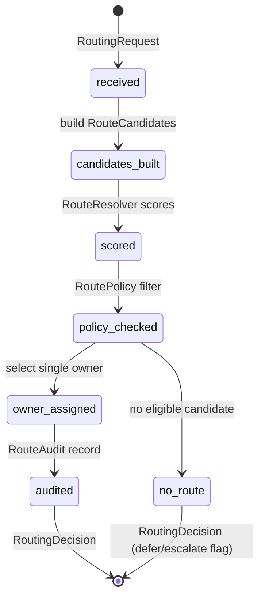

# Northbridge Workforce Router — Phase 4 Design v1.0

**Status:** Approved planning document  
**Date:** 2026-07  
**Package:** `@northbridge/workforce-router`  
**Prerequisite:** [Architecture Review v1.0](./northbridge-workforce-platform-architecture-review-v1.md) — **PASS**

**Governance:**

- [Workforce Communication Protocol v1.0](./northbridge-digital-workforce-communication-protocol-v1.md) — §4 routing, single owner invariant
- [Workforce Execution Plan v1.0](./northbridge-digital-workforce-execution-plan-v1.md) — M5 Conversation router
- NBS-004 — platform package boundaries

**Planning only. No code authorized by this document.**

---

## 1. Objective

Implement `@northbridge/workforce-router` — the **reusable platform engine that determines request ownership**.

The router:

- **Does** assign exactly one `RequestOwner` per inbound work unit
- **Does** evaluate product-supplied routing rules
- **Does** enforce entitlements and feature flags
- **Does** support deduplication and owner transfer
- **Does** emit audit records

The router:

- **Does not** execute work (specialist-runtime / team-orchestrator)
- **Does not** synthesize responses (team-orchestrator)
- **Does not** know Nordi, Marketing, Dental, Sales, UI, or dashboards
- **Does not** implement manager/director/VP routing behavior at launch (schema-ready only)

---

## 2. Position in platform stack

```text
                    ┌─────────────────────────┐
  Product layer     │ Route rules, entitlements│  (NBD, Aviator, etc.)
                    └───────────┬─────────────┘
                                │ injects
                    ┌───────────▼─────────────┐
  Platform          │  @northbridge/          │
                    │  workforce-router       │  ← Phase 4
                    └───────────┬─────────────┘
                                │ RoutingDecision
              ┌─────────────────┼─────────────────┐
              ▼                 ▼                 ▼
     team-orchestrator   conversation-engine   NDP BFF
              │
              ▼
     specialist-runtime
```

### Updated dependency graph

```text
workforce-contracts
        ↓
workforce-core
        ↓
workforce-router              (NEW)
        ↓
team-orchestrator             (+ optional import of RoutingDecision types/helpers)
specialist-runtime            (unchanged)
```

**Dependencies for `@northbridge/workforce-router`:**

```json
{
  "@northbridge/workforce-contracts": "file:../workforce-contracts",
  "@northbridge/workforce-core": "file:../workforce-core"
}
```

**Must NOT depend on:** `specialist-runtime`, `team-orchestrator`, `conversation-engine`, Nordi, NDP app code.

---

## 3. Routing lifecycle



This is **routing lifecycle only** — distinct from team-orchestrator or specialist-runtime lifecycles.

---

## 4. Routing examples (product rules → platform evaluation)

Products register rules. The router evaluates generically.

| Customer intent (product rule input) | Capability tag | Entitled team | Router output |
|-----------------------------------|----------------|---------------|---------------|
| "I need more customers" | `capability:customer_acquisition` | `team-marketing` | `RequestOwner { type: team, id: team-marketing }` |
| "Move tomorrow's appointments" | `capability:scheduling` | `team-scheduling` | `RequestOwner { type: team, id: ... }` |
| "Our website is down" | `capability:technical_operations` | `team-development` | `RequestOwner { type: team, id: ... }` |
| "Billing question" | `capability:finance` | `team-finance` | `RequestOwner { type: team, id: ... }` |

**Platform never hardcodes** Marketing, Dental, or team product names — rules carry opaque `teamId` / `teamProductId` references from entitlements.

---

## 5. Required interfaces

### 5.1 `RoutingRequest`

Inbound work unit to route (not a conversation message — opaque payload).

```typescript
interface RoutingRequest {
  requestId: string;
  orgId: string;
  /** Source channel — router uses for policy, not for Nordi logic */
  channel: "team" | "platform" | "connector" | "scheduled";
  /** Normalized intent signals — product may pre-classify or pass raw refs */
  payload: {
    textRef?: string;
    intentTags?: string[];
    capabilityTags?: string[];
    metadata?: Record<string, unknown>;
  };
  /** Teams entitled for this org at routing time */
  entitledTeamIds: string[];
  receivedAt: string; // ISO-8601
}
```

**Note:** When `channel === "platform"`, the **product layer** (Nordi service) decides whether to keep ownership or call the router. The router does not import or branch on Nordi.

### 5.2 `RoutingContext`

Runtime context for evaluation.

```typescript
interface RoutingContext {
  orgId: string;
  featureFlags: WorkforceFeatureFlags;
  entitledTeamIds: string[];
  activeOwners?: RequestOwner[];  // for dedup / conflict detection
  now: string;
}
```

### 5.3 `RouteCandidate`

A possible owner outcome before final selection.

```typescript
interface RouteCandidate {
  owner: RequestOwner;
  score: RouteScore;
  reasons: RouteReason[];
  /** Opaque team product ref for audit — not industry-specific */
  teamProductId?: string;
  capabilityTags?: string[];
}
```

### 5.4 `RouteScore`

```typescript
interface RouteScore {
  value: number;          // 0..1 normalized
  confidence: "high" | "medium" | "low";
  strategy: string;       // e.g. "rule", "capability", "ai-assisted"
}
```

### 5.5 `RouteReason`

```typescript
interface RouteReason {
  code: string;           // e.g. "RULE_MATCH", "CAPABILITY_MATCH", "ENTITLEMENT"
  description: string;
  ruleId?: string;
  evidenceRef?: string;
}
```

### 5.6 `RoutePolicy`

Platform + product policy envelope.

```typescript
interface RoutePolicy {
  /** Reject candidates for teams not in entitledTeamIds */
  requireEntitlement: boolean;
  /** Reject manager/director/vp candidates when flags off */
  enforceFeatureFlags: boolean;
  /** Minimum score to accept a candidate */
  minimumScore: number;
  /** Dedup window ms — reject if same topic+owner within window */
  dedupWindowMs?: number;
  /** Allow ambiguous → no route (product handles clarification) */
  allowNoRoute: boolean;
}
```

### 5.7 `RouteResolver` (strategy interface)

```typescript
interface RouteResolver {
  readonly strategyId: string;
  resolve(
    request: RoutingRequest,
    context: RoutingContext,
    rules: RouteRuleSet,
  ): Promise<RouteCandidate[]>;
}
```

**Planned implementations:**

| Resolver | Phase | Description |
|----------|-------|-------------|
| `RuleBasedRouteResolver` | 4 MVP | Deterministic rule matching |
| `CapabilityRouteResolver` | 4 MVP | Match `capabilityTags` to team capabilities |
| `CompositeRouteResolver` | 4 MVP | Merge + rank candidates from multiple resolvers |
| `AiAssistedRouteResolver` | Future | Calls platform-ai; returns candidates only |

### 5.8 `RouteRuleSet` (product-provided)

```typescript
interface RouteRule {
  ruleId: string;
  priority: number;
  match: {
    intentTags?: string[];
    capabilityTags?: string[];
    channel?: RoutingRequest["channel"];
  };
  routeTo: {
    ownerType: RequestOwnerType;  // team | manager | director | vice_president
    ownerId: string;
    teamProductId?: string;
  };
  enabled: boolean;
}

interface RouteRuleSet {
  orgId: string;
  version: number;
  rules: RouteRule[];
}
```

### 5.9 `RoutingDecision`

```typescript
interface RoutingDecision {
  requestId: string;
  orgId: string;
  status: "assigned" | "no_route" | "deferred";
  owner?: RequestOwner;           // set when status === "assigned"
  candidates: RouteCandidate[];   // ranked, auditable
  selectedReasons: RouteReason[];
  audit: RouteAudit;
}
```

### 5.10 `RouteAudit`

```typescript
interface RouteAudit {
  auditId: string;
  requestId: string;
  orgId: string;
  routerVersion: 1;
  strategyIds: string[];
  timestamp: string;
  traceId?: string;
  dedupKey?: string;
  previousOwner?: RequestOwner;
}
```

### 5.11 `WorkforceRouter`

```typescript
interface WorkforceRouter {
  route(input: {
    request: RoutingRequest;
    context: RoutingContext;
    rules: RouteRuleSet;
    policy?: RoutePolicy;
  }): Promise<RoutingDecision>;

  transferOwner(input: {
    orgId: string;
    requestId: string;
    from: RequestOwner;
    to: RequestOwner;
    reason: string;
  }): Promise<RoutingDecision>;

  /** Check dedup — returns existing owner if topic already owned */
  checkDedup?(input: {
    orgId: string;
    dedupKey: string;
    windowMs: number;
  }): RequestOwner | null;
}
```

Factory: `createWorkforceRouter(deps: WorkforceRouterDependencies)`

---

## 6. Core invariants (Communication Protocol §4)

1. **Exactly one `RequestOwner`** when `status === "assigned"`.
2. **Owner transfer** only via `transferOwner()` — never implicit.
3. **Dedup key:** `hash(orgId + normalizedTopic + ownerId)` (protocol §8).
4. **Entitlement gate:** team not entitled → candidate rejected.
5. **Feature flag gate:** manager+ candidates rejected when flags off.
6. **Nordi exclusion:** Router does not emit `type: "nordi"`. Nordi ownership is assigned by product layer when `channel === "platform"`.

---

## 7. Sequence — operational request to team

```mermaid
sequenceDiagram
    participant P as Product ingress
    participant R as WorkforceRouter
    participant RS as RouteRuleSet
    participant O as TeamOrchestrator

    P->>R: RoutingRequest + RoutingContext + rules
    R->>RS: evaluate via RouteResolver(s)
    RS-->>R: RouteCandidate[]
    R->>R: apply RoutePolicy + dedup
    R-->>P: RoutingDecision (owner=team:X)
    P->>O: TeamRequest + RoutingDecision
    Note over O: Orchestrator executes; does not re-assign owner
```

---

## 8. Package dependency impact

| Package | Change |
|---------|--------|
| `@northbridge/workforce-contracts` | Optional: add `RoutingDecision` Zod schemas if cross-service serialization needed (or keep router-local types re-exporting `RequestOwner` only) |
| `@northbridge/workforce-core` | Use `normalizeFeatureFlags`, `assertRoleTierEnabled` in policy enforcement |
| `@northbridge/workforce-router` | **NEW** |
| `@northbridge/team-orchestrator` | P2: accept optional `RoutingDecision`; deprecate `assignTeamRequestOwner` in orchestrator path |
| `@northbridge/specialist-runtime` | **No change** |
| Root `package.json` | Add `file:` dep |
| `lib/cat/communication-suite.ts` | Register package (deferred) |
| NDP Conversation Router (M5) | Composes workforce-router + conversation-engine |

---

## 9. Public API proposal (exports)

```typescript
// Factory
export { createWorkforceRouter, DefaultWorkforceRouter } from "./runtime/router.js";

// Types
export type {
  RoutingRequest,
  RoutingContext,
  RoutingDecision,
  RouteCandidate,
  RouteScore,
  RouteReason,
  RoutePolicy,
  RouteAudit,
  RouteRule,
  RouteRuleSet,
  WorkforceRouter,
  RouteResolver,
};

// Resolvers
export {
  RuleBasedRouteResolver,
  CapabilityRouteResolver,
  CompositeRouteResolver,
} from "./resolvers/index.js";

// Policy defaults
export { DEFAULT_ROUTE_POLICY } from "./policy/defaults.js";

// Helpers
export {
  buildDedupKey,
  assertSingleRouteOwner,
  filterCandidatesByEntitlement,
  filterCandidatesByFeatureFlags,
} from "./validation/index.js";

// Errors
export {
  WorkforceRouterError,
  type WorkforceRouterErrorCode,
} from "./runtime/errors.js";
```

**Not exported:** internal scoring weights, AI prompts, product rule catalogs.

---

## 10. Integration points

| Consumer | Integration |
|----------|-------------|
| **team-orchestrator** | Receives `RoutingDecision.owner` on `TeamRequest`; validates owner matches `teamId` |
| **NDP Conversation Router (M5)** | Calls `route()` on inbound messages; maps threads to owners |
| **workforce-core** | Feature flags + future entitlement service adapter |
| **workforce-contracts** | `RequestOwner`, `WorkforceFeatureFlags` types |
| **conversation-engine** | Separate channel — receives actor metadata from NDP layer, not from router directly |
| **Product apps** | Supply `RouteRuleSet` per org/industry |

---

## 11. ADRs

### ADR-W9: workforce-router vs communication-router

**Status:** Accepted

**Decision:** Implement ownership routing as `@northbridge/workforce-router` (workforce platform). The Communication Protocol's `@northbridge/communication-router` name maps to a **composition** at NDP:

```
NDP Conversation Router = workforce-router + conversation-engine + presentation-policy
```

**Rationale:** Keeps workforce platform independent of conversation transport. Aviator Network can use workforce-router without conversation-engine.

---

### ADR-W10: Router excludes Nordi

**Status:** Accepted

**Decision:** `@northbridge/workforce-router` never returns `RequestOwner { type: "nordi" }`. Nordi ownership is determined by the **NBD product layer** when the ingress channel is relationship/strategic (protocol §4 decision tree).

**Rationale:** User constraint — router must not know Nordi. Preserves "Nordi outside customer hierarchy."

**Mechanism:** `RoutingRequest.channel` distinguishes ingress; product calls router only for operational routing paths.

---

### ADR-W11: Pluggable RouteResolver strategies

**Status:** Accepted

**Decision:** Routing uses strategy pattern — `RuleBasedRouteResolver`, `CapabilityRouteResolver`, `CompositeRouteResolver` in MVP; `AiAssistedRouteResolver` later without API break.

**Rationale:** Supports rule-based MVP and future AI without locking platform.

---

## 12. Implementation plan — Phase 4 (M5 alignment)

### Milestone: M5-NEO — Workforce Router MVP

| Field | Detail |
|-------|--------|
| **Dependencies** | M4 (team-orchestrator) ✅ |
| **Package** | `@northbridge/workforce-router` |
| **Duration** | 1–2 weeks |
| **Owner** | NEO |

### Deliverables

| # | Deliverable | Validation |
|---|-------------|------------|
| 1 | Package scaffold (`package.json`, tsconfig, vitest) | typecheck |
| 2 | Types + Zod schemas (optional, mirror contracts pattern) | schema tests |
| 3 | `RuleBasedRouteResolver`, `CapabilityRouteResolver`, `CompositeRouteResolver` | unit tests |
| 4 | `DefaultWorkforceRouter` with `route()`, `transferOwner()` | unit tests |
| 5 | Policy enforcement (entitlement, feature flags, min score) | unit tests |
| 6 | Dedup helper + `buildDedupKey` | unit tests |
| 7 | `RouteAudit` emission | audit fixture tests |
| 8 | README + lifecycle diagram | docs review |
| 9 | ADR-W9, W10, W11 | committed in package/docs |
| 10 | Register in root `package.json` + communication-suite | wiring |

### Test scenarios (minimum)

| Scenario | Expected |
|----------|----------|
| Single capability match | `assigned` → team owner |
| Multiple candidates | highest score wins |
| No rule match | `no_route` or `deferred` |
| Team not entitled | candidate filtered |
| Manager candidate, flag off | rejected |
| Duplicate topic in window | existing owner returned |
| Owner transfer | audit + new decision |
| Invalid transfer (owner conflict) | error |

### Follow-up (M5-NDP — not NEO)

| Deliverable | Owner |
|-------------|-------|
| NDP Conversation Router service | NDP |
| Wire Nordi vs team thread routing | NBD |
| Persist RouteAudit to audit log | NDP |
| OpenAPI for routing API | NDP |

### Follow-up (P2 refactor)

| Deliverable | Owner |
|-------------|-------|
| team-orchestrator accepts `RoutingDecision` | NEO |
| Deprecate orchestrator `assignTeamRequestOwner` on hot path | NEO |

---

## 13. File structure (planned)

```text
packages/workforce-router/
  package.json
  tsconfig.json
  vitest.config.ts
  README.md
  docs/
    ADR-W9-workforce-router-vs-communication-router.md
    ADR-W10-router-excludes-nordi.md
    ADR-W11-pluggable-route-resolvers.md
  src/
    types/
      request.ts
      decision.ts
      candidate.ts
      policy.ts
      rules.ts
      audit.ts
    resolvers/
      rule-based.ts
      capability-based.ts
      composite.ts
    policy/
      defaults.ts
      enforce.ts
    validation/
      dedup.ts
      entitlement.ts
    runtime/
      router.ts
      errors.ts
    index.ts
  tests/
    router.test.ts
    resolvers.test.ts
    policy.test.ts
```

---

## 14. Remaining limitations (post Phase 4)

- No AI-assisted resolver until platform-ai integration authorized
- No cross-team collaboration routing (future collaboration-session package)
- No persistent audit store (NDP responsibility)
- No Nordi routing (product layer)
- Manager/director/VP routing **schema-ready only** — rejected at policy layer when flags off
- Inventory v1.0 team catalog not required for router MVP (uses entitled team ids from context)

---

## 15. Related documents

- [Architecture Review v1.0](./northbridge-workforce-platform-architecture-review-v1.md)
- [Workforce Communication Protocol v1.0](./northbridge-digital-workforce-communication-protocol-v1.md)
- [Workforce Execution Plan v1.0](./northbridge-digital-workforce-execution-plan-v1.md)
- `@northbridge/workforce-contracts` — [README](../packages/workforce-contracts/README.md)
- `@northbridge/team-orchestrator` — [README](../packages/team-orchestrator/README.md)

---

## 16. Document control

| Version | Date | Notes |
|---------|------|-------|
| 1.0 | 2026-07 | Initial Phase 4 design — workforce-router |

**Planning only. No code authorized.**
