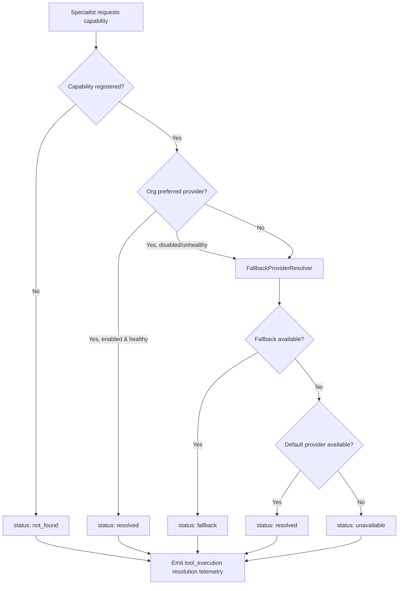

# Northbridge Digital Tool & Connector Registry

Product composition layer for provider-independent Digital Employees.

Digital Employees request **capabilities** (for example `schedule.create`). They never reference provider names (for example Google Calendar). Organizations bind providers through configuration.

## Architecture

```text
Appointment Specialist
        │
        ▼
Execution Capabilities (schedule.create, schedule.update, schedule.cancel)
        │
        ▼
CapabilityResolver
        │
        ├── PreferredProviderResolver
        ├── FallbackProviderResolver
        └── Organization Policy Overrides
        │
        ▼
ConnectorRegistry
        │
        ├── ConnectorCapability (metadata)
        ├── ConnectorProvider (metadata)
        └── ConnectorDescriptor (org binding)
        │
        ▼
Provider (Google Calendar | Microsoft Outlook | Calendly | …)
```

## Capability resolution flow



Resolution emits `tool_execution` events with `metadata.resolutionOnly: true`. No provider SDK calls or execution telemetry.

## Components

| Component | Purpose |
|-----------|---------|
| `ConnectorRegistry` | Register capabilities, providers, org descriptors, and policies |
| `ConnectorCapability` | Execution-level capability metadata |
| `ConnectorProvider` | Vendor provider metadata (no SDK) |
| `ConnectorDescriptor` | Org-specific provider binding |
| `ConnectorBinding` | Provider → capability mapping |
| `ConnectorConfigurationReference` | Config reference without secrets |
| `ConnectorHealthSnapshot` | Health metadata for availability checks |
| `CapabilityResolver` | Resolve provider for a capability request |
| `PreferredProviderResolver` | Apply org preferred provider policy |
| `FallbackProviderResolver` | Apply fallback and default provider selection |

## Catalog

Metadata-only provider catalog across six categories:

- **Scheduling** — Google Calendar, Microsoft Outlook, Calendly
- **CRM** — HubSpot, Salesforce, Zoho
- **Accounting** — QuickBooks, Xero, Stripe Billing
- **Messaging** — Gmail, Outlook Mail, Twilio, WhatsApp Business
- **Marketing** — Meta Ads, Google Ads, LinkedIn
- **Storage** — Google Drive, OneDrive, Dropbox

## Team Catalog integration

Specialists map to execution capabilities via `integration/team-capabilities.ts`:

```typescript
"appointment-specialist" → ["schedule.create", "schedule.update", "schedule.cancel"]
```

Routing tags (`capability:scheduling`) map to execution capabilities separately in `catalog/capabilities.ts`. The Team Catalog itself remains metadata-only.

## Communication Router integration

Inject `CapabilityResolver` into `CommunicationRouterDependencies`:

```typescript
const registry = createNdpConnectorRegistry();
registerDefaultSchedulingConnectors(registry, orgId);

const router = createCommunicationRouter({
  // ...existing deps
  capabilityResolver: new CapabilityResolver({ registry }),
});

const availability = router.resolveAvailableCapabilities({
  orgId,
  capabilityIds: ["schedule.create", "schedule.cancel"],
});
```

This resolves availability only — no connector execution.

## Extension guide for future providers

1. **Add provider metadata** to `catalog/providers.ts` with `supportedCapabilityIds`.
2. **Add execution capabilities** to `catalog/capabilities.ts` if new actions are needed.
3. **Register org descriptors** via `createOrgConnectorDescriptor()` or bootstrap helpers.
4. **Set org policy** with `registerOrgPolicy()` for preferred/fallback providers.
5. **Implement workforce-connectors `Connector`** in a future phase when SDK integration is ready — NDP registry remains the composition layer.

Example:

```typescript
const registry = createNdpConnectorRegistry();

registry.registerDescriptor(
  createOrgConnectorDescriptor({
    orgId: "org-acme",
    providerId: "provider:hubspot",
    capabilityIds: ["crm.contact.create", "crm.contact.update"],
  }),
);

registry.registerOrgPolicy({
  orgId: "org-acme",
  capabilityId: "crm.contact.create",
  preferredProviderId: "provider:hubspot",
  fallbackProviderIds: ["provider:salesforce", "provider:zoho-crm"],
});
```

## Boundaries

- No SDK integrations
- No OAuth or provider secrets
- No external API calls
- No changes to reusable `@northbridge/*` workforce packages
- No customer-facing behavior changes

## Related packages

| Package | Role |
|---------|------|
| `@northbridge/workforce-connectors` | Platform execution abstraction (future SDK wiring) |
| `@northbridge/workforce-observability` | Resolution telemetry event schema |
| `lib/ndp/workforce/catalog` | Team and specialist routing metadata |
| `lib/ndp/conversation-router` | Org capability availability exposure |
