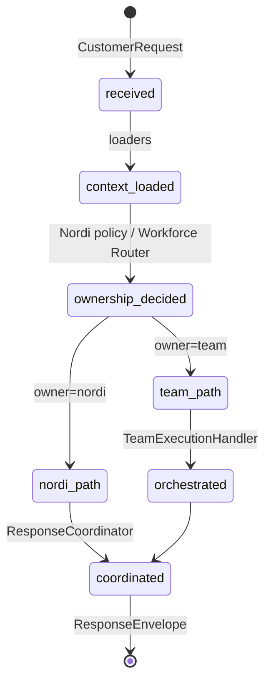
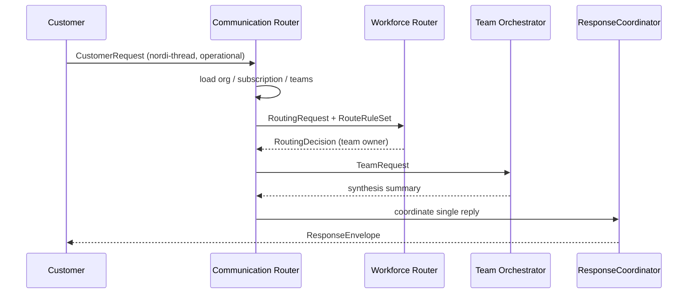

# Northbridge Digital — Communication Router

Product composition layer for customer interactions (NDP Phase 5).

**This is Northbridge Digital product code** — not NEO platform infrastructure.

## Purpose

Composes Nordi, conversation-engine, `@northbridge/workforce-router`, `@northbridge/team-orchestrator`, and `@northbridge/specialist-runtime` into one coordinated customer experience.

The Communication Router:

- Receives customer requests
- Loads organization, subscription, and team context
- Determines conversation ownership (Nordi vs Team at launch)
- Invokes Workforce Router for operational routing
- Invokes Team Orchestrator when a team owns work
- Returns **one** coordinated `ResponseEnvelope`

The Communication Router does **not**:

- Execute specialist logic directly
- Hardcode Marketing, Dental, Sales, or other domain teams
- Modify reusable workforce packages
- Implement manager/director/VP behavior at launch

## Architecture

```text
Customer Request
       ↓
Communication Router (lib/ndp)
       ├─ OrganizationContextLoader
       ├─ SubscriptionResolver
       ├─ TeamResolver
       ├─ ConversationContextBuilder
       ├─ Ownership Decision
       │    ├─ Nordi policy (product)
       │    └─ @northbridge/workforce-router (platform)
       ├─ NordiConversationHandler OR TeamExecutionHandler
       └─ ResponseCoordinator → ResponseEnvelope
```

Per [ADR-W9](../../packages/workforce-router/docs/ADR-W9-workforce-router-vs-communication-router.md):

```
NDP Communication Router = workforce-router + conversation-engine + presentation-policy (+ Nordi product layer)
```

## Customer request lifecycle



## Sequence — operational request via Nordi



## Quick start

```typescript
import {
  createWorkforceRouter,
  createDefaultCompositeResolver,
} from "@northbridge/workforce-router";
import {
  createCommunicationRouter,
  DefaultOwnershipDecisionService,
  InMemoryOrganizationContextLoader,
  InMemorySubscriptionResolver,
  InMemoryTeamResolver,
} from "@/lib/ndp/conversation-router";

const workforceRouter = createWorkforceRouter({
  resolver: createDefaultCompositeResolver(),
});

const communicationRouter = createCommunicationRouter({
  organizationLoader,
  subscriptionResolver,
  teamResolver,
  ownershipDecision: new DefaultOwnershipDecisionService(workforceRouter),
  resolveRouteRules: async (orgId) => productRuleSets.get(orgId),
  teamHandler: teamOrchestratorHandler, // optional — inject real orchestrator
  nordiHandler: nordiCustomerSuccessHandler, // optional — wire lib/nordi + consent
});

const envelope = await communicationRouter.handleRequest({ request: customerRequest });
```

## Required components

| Component | Role |
|-----------|------|
| `CommunicationRouter` | Main entry — `handleRequest()` |
| `CustomerRequest` | Inbound customer message DTO |
| `ConversationContextBuilder` | Assembles routing context |
| `OrganizationContextLoader` | Org + permissions + feature flags |
| `SubscriptionResolver` | Entitlements / subscription status |
| `TeamResolver` | Hired teams + active conversations |
| `ConversationOwnership` | Nordi vs team decision + audit refs |
| `ResponseCoordinator` | Single customer-visible reply |
| `ResponseEnvelope` | Outbound coordinated response |
| `CustomerInteractionSession` | Thread/session continuity metadata |

## Extension guide

| Extension | Product provides |
|-----------|------------------|
| `OrganizationContextLoader` | Tenant store / BFF |
| `SubscriptionResolver` | Billing + entitlements service |
| `TeamResolver` | Hire catalog + active thread index |
| `resolveRouteRules` | Product `RouteRuleSet` per org |
| `NordiConversationHandler` | Nordi voice, memory, consent, localization |
| `ConversationEngineNordiHandler` | Import from `./adapters/conversation-turn.js` — wraps `decideConversationTurn` |
| `TeamExecutionHandler` | `TeamOrchestratorExecutionHandler` with roster/runtime |
| `ResponseCoordinator` | Custom metadata / presenter hooks |

## Launch scope

Supported:

- Nordi-owned requests (platform, billing, recommendations, relationship)
- Team-owned requests (via Workforce Router + Team Orchestrator adapter)
- Subscription gaps, routing failures, continuity, escalation passthrough

Not implemented (interfaces only):

- Manager / Director / VP ownership paths

## ADRs

- [ADR-NDP-1](./docs/ADR-NDP-1-communication-router-composition.md)

## Related documents

- [Workforce Communication Protocol v1.0](../../docs/northbridge-digital-workforce-communication-protocol-v1.md)
- [Workforce Router Phase 4 Design](../../docs/northbridge-workforce-router-phase-4-design-v1.md)
- [Execution Plan M5](../../docs/northbridge-digital-workforce-execution-plan-v1.md)
