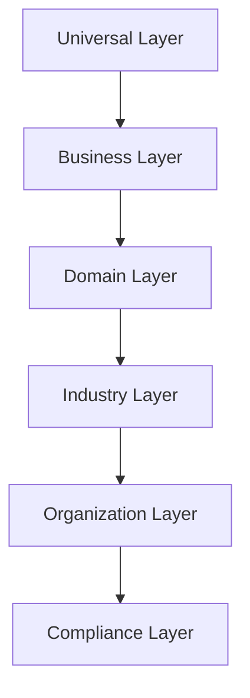

# Knowledge Pack Framework

Reusable knowledge definition layer for Northbridge Digital Employees.

Digital Employees reference **Knowledge Pack IDs** — not raw knowledge content or prompts.

## Composition model

A Digital Employee is composed of:

```text
Manifest
  + Knowledge Packs (ordered layers)
  + Prompt Template (future)
  + Connector Capabilities
  + Organization Context
  + Memory
```

This phase implements **Knowledge Packs only**.

## Layering

```text
Appointment Specialist
        │
        ▼
Professional Communication        (universal)
        │
        ▼
Business Writing                  (universal)
        │
        ▼
Business Operations Fundamentals  (business)
        │
        ▼
Scheduling Fundamentals           (domain)
        │
        ▼
Dental Fundamentals               (industry — when team context applies)
        │
        ▼
Northbridge Communication Standards (organization)
```



## Concepts

| Concept | Description |
|---------|-------------|
| **Knowledge Pack** | Reusable metadata asset with dependencies, trust level, and applicability |
| **Prompt** | Future template layer — not part of this phase |
| **Memory** | Runtime conversation/org context — separate from static knowledge packs |
| **Manifest** | Digital Employee configuration referencing pack IDs |
| **Connector** | Execution capability (`schedule.create`) — not knowledge content |

## Knowledge Pack schema

```typescript
interface KnowledgePack {
  knowledgePackId: string;
  displayName: string;
  category: KnowledgeCategory;
  version: string;
  description: string;
  tags: string[];
  dependencies: string[];
  trustLevel: "canonical" | "verified" | "draft" | "experimental";
  owner: string;
  layer: KnowledgeLayerType;
  layerOrder: number;
  applicableTeams: string[];
  applicableEmployees: string[];
  lifecycleStatus: "draft" | "active" | "deprecated" | "archived";
  launchVisible: boolean;
}
```

## Launch packs (14)

**Universal**
- Professional Communication
- Customer Service Fundamentals
- Business Writing

**Business / Domain**
- Business Operations Fundamentals
- Scheduling Fundamentals
- Sales Fundamentals
- Marketing Fundamentals
- Financial Fundamentals

**Industry**
- Aviation Fundamentals
- Dental Fundamentals
- Legal Fundamentals
- HVAC Fundamentals

**Organization**
- Northbridge Customer Success Doctrine
- Northbridge Communication Standards

No knowledge articles. No embeddings. No RAG.

## Dependency examples

```text
Dental Fundamentals
  → Scheduling Fundamentals
    → Business Operations Fundamentals
      → Business Writing
        → Professional Communication

Northbridge Customer Success Doctrine
  → Customer Service Fundamentals
    → Professional Communication
```

## Employee integration

Digital Employee manifests include `knowledgePackIds`:

```typescript
{
  employeeId: "employee-appointment",
  knowledgePackIds: [
    "knowledge-pack-professional-communication",
    "knowledge-pack-scheduling-fundamentals",
    "knowledge-pack-northbridge-communication-standards",
  ],
}
```

## Knowledge Resolution Plan

`buildKnowledgeResolutionPlan()` expands dependencies and returns an ordered pack list for future loading:

```typescript
const plan = buildKnowledgeResolutionPlan({
  manifest,
  registry,
  teamId: "team-dental-office", // optional industry layer
});
```

No execution. No prompt generation.

## Validation

- Acyclic dependency graph
- All referenced packs exist
- Team and employee compatibility
- Semver version checks
- Launch visibility rules (no experimental packs at launch)

## Adding a future Knowledge Pack

1. Add metadata to `catalog/launch-packs.ts`
2. Declare `dependencies` for layering
3. Set `applicableTeams` / `applicableEmployees` when scoped
4. Reference pack IDs from employee manifests
5. Run `knowledge.test.ts`

## Boundaries

- No prompts or knowledge articles
- No RAG, embeddings, or vector databases
- No changes to reusable `@northbridge/*` workforce packages
- No Team Orchestrator or Communication Router behavior changes

## Related modules

| Module | Role |
|--------|------|
| `lib/ndp/workforce/manifests/` | Digital Employee definitions |
| `lib/ndp/workforce/catalog/` | Team and specialist inventory |
| `lib/ndp/connectors/` | Tool execution capabilities |
