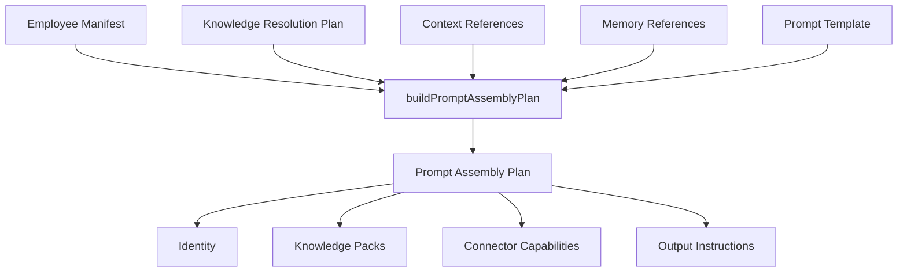

# Prompt Template Framework

Defines how runtime prompts are **assembled** — not production prompt text.

Digital Employees compose runtime prompts from reusable layers. This phase creates the template composition framework only.

## Composition model

```text
Runtime Prompt =
  Employee Manifest
  × Knowledge Resolution Plan
  × Organization Context (reference)
  × Conversation Context (reference)
  × Memory Context (reference)
  × Connector Capabilities
  × Prompt Template
  → Prompt Assembly Plan (metadata only)
```



No LLM calls. No text concatenation. No production wording.

## Concepts

| Concept | Description |
|---------|-------------|
| **Prompt Template** | Metadata defining section order and requirements |
| **Knowledge Pack** | Reusable knowledge asset referenced in assembly |
| **Manifest** | Digital Employee configuration |
| **Memory** | Runtime conversation/customer memory — referenced, not loaded |
| **Context** | Organization/conversation/customer context — referenced only |
| **Runtime Prompt** | Future composed output — not generated in this phase |

## Template schema

```typescript
interface PromptTemplate {
  templateId: string;
  displayName: string;
  category: PromptTemplateCategory;
  version: string;
  sectionOrder: PromptTemplateSectionId[];
  requiredManifestSections: ManifestSectionId[];
  requiredKnowledgeLayers: KnowledgeLayerType[];
  requiredContextProviders: ContextProviderId[];
  requiredMemoryProviders: MemoryProviderId[];
  requiredConnectorSections: PromptTemplateSectionId[];
  outputStyle: OutputProfile;
  launchVisible: boolean;
}
```

## Template sections (16)

Identity, Responsibilities, Objectives, Operating Principles, Organization Context, Customer Context, Conversation Context, Memory Context, Knowledge Packs, Available Capabilities, Available Connector Capabilities, KPIs, Escalation Rules, Communication Style, Constraints, Output Instructions.

Templates reference section IDs — they do not embed large text blocks.

## Launch templates (5)

| Template | Output Style | Role |
|----------|--------------|------|
| Marketing Specialist | specialist | specialist |
| Sales Specialist | advisor | specialist |
| Customer Service Specialist | specialist | specialist |
| Financial Specialist | structured_report | specialist |
| Team Lead | team_lead | team_lead |

## Prompt Assembly Plan

```typescript
const plan = buildPromptAssemblyPlan({
  manifest,
  knowledgePlan,
  template,
  contextReferences: {
    organizationContextRef: "org:org-acme",
    conversationContextRef: "thread:thread-1",
  },
  memoryReferences: {
    threadMemoryRef: "memory:thread-1",
  },
});
```

Output includes:
- Selected template
- Ordered sections with source references
- Knowledge packs referenced
- Manifest sections used
- Context and memory providers required
- Connector capability sections required

## Output profiles

- `advisor` — consultative customer-facing tone
- `specialist` — task-focused execution tone
- `team_lead` — orchestration and synthesis tone
- `internal_analysis` — internal reasoning tone
- `structured_report` — formatted report tone

Metadata only — no prompt text.

## Extension guide

1. Add section definition to `types/section.ts` if needed
2. Create template metadata in `catalog/launch-templates.ts`
3. Declare `sectionOrder`, required layers, context providers
4. Validate with `validatePromptTemplateCatalog()`
5. Test assembly with `buildPromptAssemblyPlan()`

Do not add production prompt wording to templates.

## Boundaries

- No production prompts or system prompts
- No LLM calls
- No runtime prompt text concatenation
- No changes to `@northbridge/*` workforce packages
- No Team Orchestrator or Specialist Runtime behavior changes

## Related modules

| Module | Role |
|--------|------|
| `lib/ndp/workforce/manifests/` | Employee configuration |
| `lib/ndp/workforce/knowledge/` | Knowledge resolution plan |
| `lib/ndp/connectors/` | Connector capability metadata |
