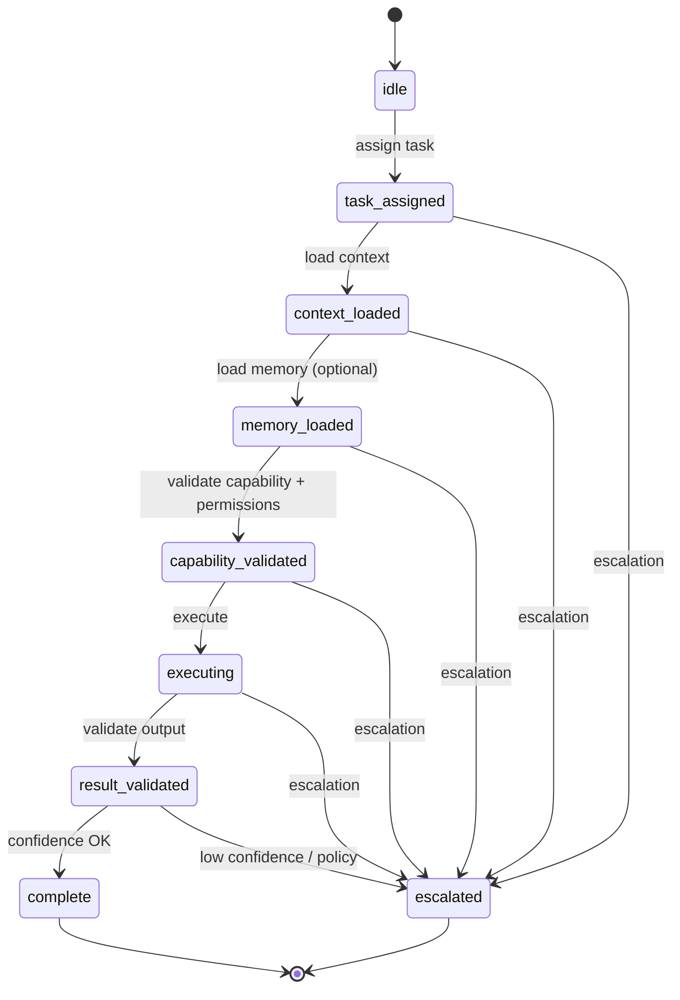

# @northbridge/specialist-runtime

Reusable execution runtime for digital specialists (NEO Phase 2).

**Domain-agnostic.** No Marketing, Sales, Dental, Nordi, Team Lead, or product UI logic.

## Purpose

Provides the operating system every future specialist inherits:

- Lifecycle state machine
- Task execution envelope
- Permission enforcement (via `@northbridge/workforce-core`)
- Capability registry validation
- Memory and conversation **adapter interfaces** (no implementations)
- Progress reporting and confidence scoring
- Escalation requests

Products define only: **capabilities**, **prompts**, **domain knowledge**, **policies**, and a **`TaskExecutor`**.

## Lifecycle



## Quick start

```typescript
import {
  createSpecialistRuntime,
  InMemoryCapabilityRegistry,
} from "@northbridge/specialist-runtime";

const registry = new InMemoryCapabilityRegistry();
registry.register("my-specialist-def", [
  { id: "execute_task", requiredPermission: "execute_task" },
]);

const runtime = createSpecialistRuntime({
  capabilityRegistry: registry,
  taskExecutor: {
    async execute({ context }) {
      return {
        summary: "Task complete",
        confidence: { level: "high", score: 0.9 },
        evidence: [],
      };
    },
  },
});

const result = await runtime.runTask({ task, specialist });
```

## Extension guide

### 1. Register capabilities

Map specialist definition ids to capability ids. Each capability references a **permission action** checked against `task.permissions` using workforce-core.

### 2. Implement TaskExecutor

Your domain package implements `TaskExecutor.execute()` — prompts, tools, and model calls live **outside** this runtime.

### 3. Plug memory (optional)

Implement `SpecialistMemoryAdapter` and connect to `@northbridge/conversation-state` or future memory stores.

### 4. Plug conversation context (optional)

Implement `SpecialistConversationAdapter.loadThreadContext()` — connect to conversation-engine/state.

### 5. Configure policy

Use `RuntimePolicy` for minimum confidence, required capability, and adapter toggles.

### 6. Handle outcomes

- `complete` → `TaskResult` from workforce-contracts
- `escalated` → `EscalationRequest` for Team Lead / orchestrator
- `failed` → `SpecialistRuntimeError` with code

## Dependencies

| Package | Usage |
|---------|-------|
| `@northbridge/workforce-contracts` | `Task`, `TaskResult`, `Specialist`, `Escalation` shapes |
| `@northbridge/workforce-core` | Permission checks |

## Scripts

```bash
npm run typecheck
npm run test
npm run build
```

## ADR

See [ADR-W2](./docs/ADR-W2-specialist-runtime-boundaries.md).

## Source of truth

- [Workforce Execution Plan v1.0](../../docs/northbridge-digital-workforce-execution-plan-v1.md) — Phase 2
- [Workforce Communication Protocol v1.0](../../docs/northbridge-digital-workforce-communication-protocol-v1.md) — Layer 3
