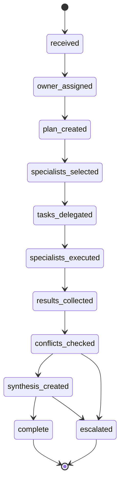

# @northbridge/team-orchestrator

Reusable Team Lead orchestration engine (NEO Phase 3).

**Platform infrastructure only** — no Marketing, Sales, Dental, Nordi, mobile, or dashboard UI.

## Purpose

Coordinates how a Team Lead:

- Receives team-owned requests
- Assigns **single request ownership** (Communication Protocol v1.0)
- Plans and selects specialists
- Delegates tasks via `@northbridge/specialist-runtime`
- Collects results and detects conflicts
- Synthesizes **one** team response
- Builds `TeamReport` (workforce-contracts)

Specialists remain **internal** at launch — customer-facing voice is always the Team Lead.

## Lifecycle



## Quick start (generic specialists)

```typescript
import {
  createTeamOrchestrator,
  DefaultExecutionPlanBuilder,
  DefaultTeamSynthesizer,
  DefaultTeamReportBuilder,
  DefaultConflictDetector,
  InMemorySpecialistRoster,
  PassthroughSpecialistSelector,
  SharedSpecialistRuntimeFactory,
} from "@northbridge/team-orchestrator";
import { createSpecialistRuntime } from "@northbridge/specialist-runtime";

const runtime = createSpecialistRuntime({ /* capabilityRegistry, taskExecutor */ });

const orchestrator = createTeamOrchestrator({
  roster: new InMemorySpecialistRoster(specialists),
  runtimeFactory: new SharedSpecialistRuntimeFactory(runtime),
  specialistSelector: new PassthroughSpecialistSelector(selections),
  planBuilder: new DefaultExecutionPlanBuilder(),
  synthesizer: new DefaultTeamSynthesizer(),
  reportBuilder: new DefaultTeamReportBuilder(),
  conflictDetector: new DefaultConflictDetector(),
});

const result = await orchestrator.orchestrate({ request });
```

## Extension guide

| Extension point | Product provides |
|-----------------|------------------|
| `SpecialistRoster` | Team roster resolution from entitlements |
| `SpecialistSelector` | Routing logic (which specialists handle request) |
| `ExecutionPlanBuilder` | Task breakdown strategy |
| `TaskExecutor` (via specialist-runtime) | Domain prompts/tools |
| `TeamSynthesizer` | Team voice / formatting |
| `TeamReportBuilder` | Report metrics enrichment |
| `ConflictDetector` | Domain-specific conflict rules |
| `CrossTeamCollaborationAdapter` | Future cross-team sessions (interface only) |

## Dependencies

- `@northbridge/workforce-contracts` — `Task`, `TaskResult`, `TeamReport`, `RequestOwner`
- `@northbridge/workforce-core` — org/team validation (future integration)
- `@northbridge/specialist-runtime` — specialist task execution

## Scripts

```bash
npm run typecheck
npm run test
npm run build
```

## ADR

See [ADR-W3](./docs/ADR-W3-team-orchestrator-boundaries.md).

## Limitations (Phase 3)

- Cross-team collaboration is **interface only**
- Managers/Directors/VPs are **not** active runtime behavior
- Nordi escalation produces `TeamEscalation` — Nordi handling is product-layer
- No billing, recommendation engine, or mobile/dashboard UI
