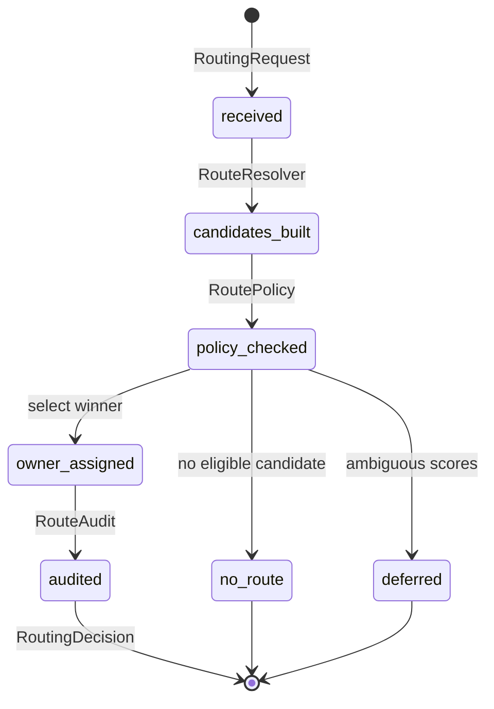

# @northbridge/workforce-router

Reusable workforce request ownership router (NEO Phase 4).

**Platform infrastructure only** — no Nordi, Marketing, Dental, Sales, UI, dashboards, or execution logic.

## Purpose

Determines **who owns an inbound work request**:

- Evaluates product-supplied routing rules
- Applies entitlements and feature flags
- Scores and ranks route candidates
- Enforces deduplication and owner transfer
- Emits audit records

The router **does not** execute tasks or synthesize responses.

## Lifecycle



## Quick start

```typescript
import {
  createWorkforceRouter,
  createDefaultCompositeResolver,
} from "@northbridge/workforce-router";

const router = createWorkforceRouter({
  resolver: createDefaultCompositeResolver(),
});

const decision = await router.route({
  request: {
    requestId: "req-1",
    orgId: "org-1",
    channel: "team",
    payload: { capabilityTags: ["capability:scheduling"] },
    entitledTeamIds: ["team-scheduling"],
    receivedAt: new Date().toISOString(),
  },
  context: {
    orgId: "org-1",
    featureFlags: {
      managersEnabled: false,
      directorsEnabled: false,
      vpsEnabled: false,
    },
    entitledTeamIds: ["team-scheduling"],
    now: new Date().toISOString(),
  },
  rules: productRuleSet,
});

if (decision.status === "assigned") {
  // Pass decision.owner to team-orchestrator or conversation router
}
```

## Extension points

| Extension | Product provides |
|-----------|------------------|
| `RouteRuleSet` | Intent/capability → owner mappings |
| `RoutePolicy` | Entitlement, score thresholds, dedup window |
| `RouteResolver` | Custom strategies (rule, capability, composite, future AI) |
| `DedupStore` | Persistent dedup (default: in-memory) |

## Resolvers (MVP)

- `RuleBasedRouteResolver` — deterministic rule matching
- `CapabilityRouteResolver` — capability tag overlap scoring
- `CompositeRouteResolver` — merge and rank multiple strategies

Future: `AiAssistedRouteResolver` via `RouteResolver` interface (not implemented).

## Invariants

1. Exactly one `RequestOwner` when `status === "assigned"`
2. Router never assigns `type: "nordi"` (ADR-W10)
3. Manager/director/VP candidates rejected when feature flags off
4. Team candidates rejected when not entitled

## Dependencies

- `@northbridge/workforce-contracts`
- `@northbridge/workforce-core`

## ADRs

- [ADR-W9](./docs/ADR-W9-workforce-router-vs-communication-router.md)
- [ADR-W10](./docs/ADR-W10-router-excludes-nordi.md)
- [ADR-W11](./docs/ADR-W11-pluggable-route-resolvers.md)

## Related documents

- [Phase 4 Design](../../docs/northbridge-workforce-router-phase-4-design-v1.md)
- [Architecture Review v1.0](../../docs/northbridge-workforce-platform-architecture-review-v1.md)
